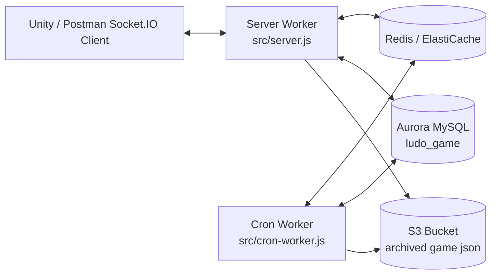
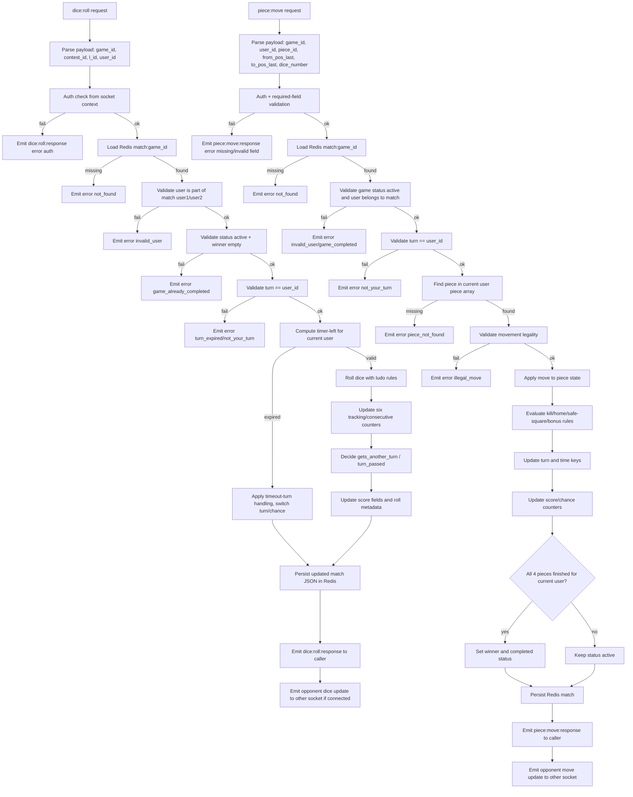
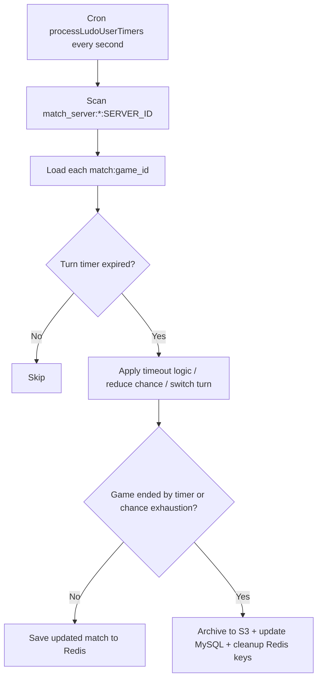

# Ludo Game Flow Diagram (Current Implementation)

This file explains the **actual current flow** in this project:
- Runtime: **Server** + **Cron Worker**
- Primary state: **Redis**
- Durable records: **MySQL (`ludo_game`)**
- Final archive: **S3 JSON**
- No Cassandra for current Ludo flow

---

## 1) High-Level Architecture



---

## 2) Redis Keys Used

- `contest_join:<user_id>:<contest_id>:<l_id>`
  - waiting/join snapshot for that player+contest+l_id
- `match:<game_id>`
  - live match state (turn, pieces, dice, timers, score, status)
- `match_server:<game_id>:<server_id>`
  - ownership hint for cron timer scan per server
- `user_to_socket:<user_id>` / `socket_to_user:<socket_id>`
  - active socket mapping

---

## 3) Matchmaking Flow (Join -> Matched)

```mermaid
flowchart TB
  A[Socket connect with user_id contest_id l_id] --> B[Socket auth + required field validation]
  B --> C[Store contest_join key in Redis]
  C --> D[Background upsert in MySQL ludo_game status=pending]
  D --> E[Cron matchmaking tick]
  E --> F[Load pending rows from ludo_game]
  F --> G{Can pair two users\n(same league/contest/type, different users)?}
  G -- No --> H[Keep waiting]
  G -- Yes --> I[Create game_id + initialize pieces + dice]
  I --> J[Write match:game_id in Redis]
  J --> K[Write match_server:game_id:server_id]
  K --> L[Update both MySQL rows to matched + opponent + match_id + turn_id]
  L --> M[Delete both users contest_join keys]
```

Notes:
- Queue order comes from MySQL pending scan logic in cron.
- Pending expiry and settlement are also handled by cron services.

---

## 4) `check:opponent` Flow

```mermaid
flowchart TB
  A[Client emits check:opponent with user_id contest_id l_id] --> B[Auth + required fields]
  B --> C[Try Redis contest_join snapshot first]
  C --> D{Has valid match_id + opponent?}
  D -- Yes --> E[Load match state from Redis match:game_id]
  D -- No --> F[Fallback MySQL lookup in ludo_game]
  F --> G{status?}
  G -- pending --> P[Emit pending response]
  G -- expired --> X[Emit expired + disconnect]
  G -- completed --> Z[Emit completed]
  E --> R{pieces(4+4) and dice ready?}
  R -- No --> P
  R -- Yes --> S[Emit success opponent:response with game data]
```

Important:
- This handler is optimized to check Redis first to reduce DB load.
- DB is used as fallback/authority for terminal states.

---

## 5) Gameplay Flow (Dice + Piece)



### 5.1 Dice:rule details
- Validates: auth, payload fields, match exists, user in match, game active, correct turn.
- Timer gate: if turn expired, timeout path runs before normal roll response.
- Roll logic includes:
  - normal random roll (1-6),
  - six/consecutive six tracking,
  - extra-turn decisions,
  - turn pass decisions,
  - scoring metadata update.
- Redis is source of truth for live state (`match:<game_id>`).
- Emits:
  - `dice:roll:response` to caller,
  - opponent update event to opponent socket when available.

### 5.2 Piece:move rule details
- Validates: auth, required payload, user membership, turn ownership, selected piece.
- Movement checks include:
  - valid position transition,
  - first-six/home exit rules,
  - overshoot/illegal destination checks,
  - collision/kill/safe-square behavior.
- After move:
  - updates piece array,
  - updates turn and timers,
  - updates score/chance counters,
  - checks winner/completion.
- On completion, end-game pipeline continues (archive + DB + Redis cleanup).
- Emits:
  - `piece:move:response` to caller,
  - opponent move update event.

### 5.3 Read API during gameplay
- `get:match_state` reads the current Redis match object and returns:
  - turn, status, winner,
  - both users piece arrays,
  - score/chance fields,
  - time-left fields (`user1_time_left_seconds`, `user2_time_left_seconds`).

---

## 6) Timer and Expiry Flow (Cron)



Current behavior:
- Cron handles timer processing even if no socket timer emits are sent.
- Expired pending join cleanup is a separate cron service.

---

## 7) End Game / Quit / Cleanup

A game can finish by:
- Normal win in gameplay
- Quit flow
- Timer/settlement completion in cron

Common end steps:
1. Finalize status/winner metadata
2. Archive final match JSON to S3
3. Update `ludo_game` (status, ended_at, s3_key, s3_etag)
4. Delete Redis match keys (`match:*`, `match_server:*:*`)

---

## 8) MySQL Table Used (Current)

Primary table for Ludo in this project:
- `ludo_game`

Used for:
- pending/matched/completed/expired status
- user/opponent linkage
- match_id linkage
- timestamps
- S3 archive references
- dice/piece ID columns

---

## 9) Worker Responsibilities (Simple)

- **Server worker**
  - socket auth, handlers, live game events, Redis updates
- **Cron worker**
  - matchmaking, turn timer processing, expiry cleanup, settlements
- **Admin worker**
  - dashboard APIs (live redis view + historical MySQL + S3 preview)

---

## 10) Quick Debug Checklist

If user stays pending too long:
1. Check `contest_join:*` key exists
2. Check `ludo_game` row inserted as `pending`
3. Check cron worker running and matchmaking started
4. Check pending row satisfies pairing conditions

If matched but opponent payload incomplete:
1. Check `match:<game_id>` exists
2. Verify both users have 4 pieces and dice IDs in match state
3. Verify `ludo_game.match_id` and status are `matched/active`

If Redis keys are not cleaned:
1. Check end path executed (win/quit/timer)
2. Check cleanup function removed both `match:*` and `match_server:*:*`
3. Check pending cleanup cron for stale `contest_join:*`
